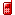

Google emoji set
================

This repository contains a full set of Google's low-resolution, animated pixel emoji (better known as those [animated icons that show up in spam messages](http://stackoverflow.com/questions/28095387/animated-icon-in-email-subject).

These adorable pictures are based on the low-res animated emoji which were used on older Japanese smartphones. 
With their cute pixel art and animation, they're very charming.  Google's set is partially based on the SoftBank set, reusing many images from it, though it's been updated in a number of ways to correspond to the set proposed for Unicode 6.0. 

Directory structure
-------------------

The "google" directory in this repository contains one file for each emoji.
These files use the Google Unicode codepoint as their filenames, for instance `U+FE000.gif`.

Codepoints and mappings
-----------------------

Because Google began using their emoji set before Unicode 6.0 was standardized, they established their own emoji region in the [Unicode private use area](https://en.wikipedia.org/wiki/Private_Use_Areas).
Most of these characters map over to the other major emoji sets in use at the time: DoCoMo, KDDI, and SoftBank.
This repository contains directories for the DoCoMo, KDDI, and SoftBank sets, and symlinks images from the Google set to the Unicode private use area codepoints of their equivalent images when a 1:1 mapping exists.

The mapping was based on [this document](http://www.unicode.org/%7Escherer/emoji4unicode/snapshot/full.html), drafted before Unicode 6.0 was standardizes, which maps together these four sets and the Unicode 6.0 draft of the time.
